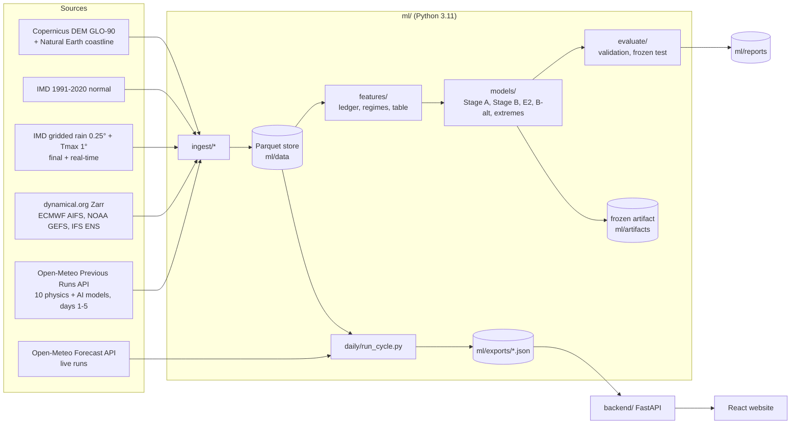

# Architecture

## Components

| Part | Folder | Job | Tech |
| :--- | :--- | :--- | :--- |
| Ingestion | `ml/ingest/` | Download, cache and harmonise every dataset into daily Parquet at the 29 district points | requests-cache, openmeteo-requests, xarray/zarr, imdlib, rasterio |
| Features | `ml/features/` | Leakage-free skill ledger, regime labels, the Stage B training table | pandas, NumPy |
| Models | `ml/models/` | Stage B gating, baselines (E2, B-alt), exceedance calibration, frozen artifacts | LightGBM, scikit-learn |
| Live blend | `ml/live/` | Stage A ledger and blend, live fetch, scorecard: the code the website's numbers come from | pandas |
| Evaluation | `ml/evaluate/` | Scores, validation experiments E0–E10, the frozen test scorecard, reports | NumPy, SciPy, matplotlib |
| Daily cycle | `ml/daily/` | One command: fetch the latest runs, update truth, blend, export JSON | — |
| Backend | `backend/` | Serves the exported JSON; accounts, preferences and alert acknowledgements | FastAPI, SQLite |
| Website | `src/` | Sign-up → onboarding → dashboard: overview, districts, forecast, models, alerts, verification, settings | React 19, TypeScript, Vite, Tailwind, React Query, Leaflet |

## Design principles

- **Offline heavy, online light.** All downloading, training and blending happens in the pipeline. The
  backend only serves small precomputed JSON, so the website never waits on an external API.
- **One source of truth per concept.** `ml/config.yaml` holds every setting: points, sources, periods,
  constants, thresholds. The live blend and the scorecard share one function (`ml/live/stage_a.py`),
  and training features reuse the same ledger definition, which a test proves equal.
- **Idempotent, resumable steps.** Every download is cached, and every output is written per chunk or
  per month. An interrupted run continues where it stopped.
- **Provenance.** Frozen models record their git commit, config hash and training data manifest.
  Reports record their commit. Test-set scoring is logged.

## Data flow for one forecast on the website

1. `run_cycle` finds the newest run common to the live models (Open-Meteo `meta.json`). It fetches days
   1–5 at 29 districts and stores them.
2. It updates IMD truth, including the real-time grids.
3. For each district, lead and variable it builds the skill ledger as of the issue date. It then
   bias-corrects and weights each model and computes the blend, its 10–90% range, exceedance
   probabilities and an alert level.
4. It writes `ml/exports/cycle_<init>.json` and `latest.json`.
5. The backend serves `/api/v1/cycle`. The website renders it, and exports it as CSV, GeoJSON or CAP 1.2.
