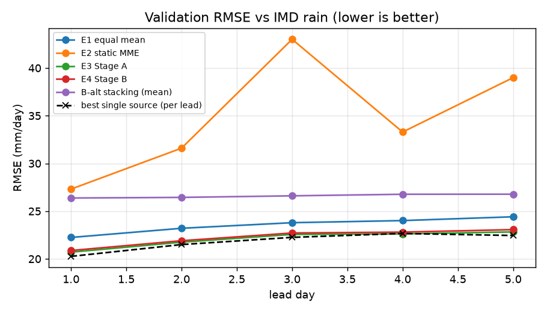
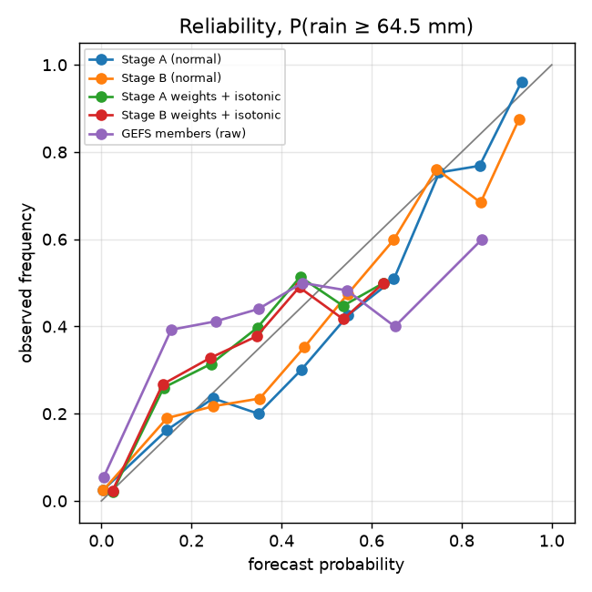
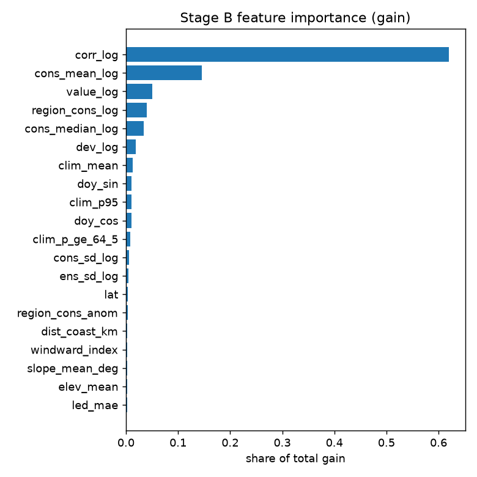

# Validation report (training period, blocked cross-validation)

Generated 2026-09-25T21:22 UTC · commit `486d70a126` · 2024-06-01 to 2024-12-29 · 29 districts · truth: IMD 0.25° gridded rainfall (final)

Every number below is out-of-fold: each month is predicted by models fitted without it and without the 10 days either side. Stage B's tau/lambda and the sigma scale are cross-fitted. The frozen test season (June-September 2025) is not used.

Chosen Stage B variant (lowest validation RMSE): **E4 Stage B**.

## Rain, all methods, by lead

### Lead day 1

| method | n | rmse | mae | bias | corr | ets_64_5 | pod_64_5 | far_64_5 | ets_115_6 | sedi_115_6 |
|:---|---:|---:|---:|---:|---:|---:|---:|---:|---:|---:|
| E3 Stage A | 2610 | 20.71 | 10.28 | -0.46 | 0.73 | 0.34 | 0.47 | 0.37 | 0.11 | 0.50 |
| E5 Stage B without regime | 2610 | 20.81 | 10.27 | -0.87 | 0.73 | 0.32 | 0.44 | 0.37 | 0.12 | 0.51 |
| E8 Stage B without season | 2610 | 20.86 | 10.27 | -1.07 | 0.73 | 0.31 | 0.42 | 0.38 | 0.12 | 0.53 |
| E4 Stage B | 2610 | 20.88 | 10.28 | -1.07 | 0.73 | 0.31 | 0.42 | 0.38 | 0.14 | 0.55 |
| E6 Stage B without lead | 2610 | 20.88 | 10.28 | -1.08 | 0.73 | 0.31 | 0.42 | 0.38 | 0.12 | 0.53 |
| E7 Stage B without place | 2610 | 20.88 | 10.28 | -1.08 | 0.73 | 0.31 | 0.42 | 0.38 | 0.14 | 0.55 |
| E10 Stage B without ensemble sources | 2610 | 20.97 | 10.29 | -1.14 | 0.72 | 0.31 | 0.42 | 0.37 | 0.12 | 0.51 |
| E4w Stage B (row weights) | 2610 | 20.98 | 10.27 | -1.58 | 0.73 | 0.28 | 0.36 | 0.34 | 0.07 | 0.43 |
| E9 Stage B without ai sources | 2610 | 21.31 | 10.49 | -1.07 | 0.71 | 0.30 | 0.41 | 0.38 | 0.12 | 0.53 |
| E1 equal mean | 2610 | 22.24 | 10.55 | -3.44 | 0.72 | 0.08 | 0.10 | 0.34 | 0.02 | – |
| B-alt stacking (mean) | 2610 | 26.38 | 14.24 | -3.38 | 0.58 | 0.00 | 0.01 | 0.00 | 0.00 | – |
| E2 static MME | 2610 | 27.31 | 14.23 | 1.21 | 0.58 | 0.25 | 0.45 | 0.57 | 0.08 | 0.39 |
| ecmwf_aifs025_single | 2610 | 20.26 | 10.81 | 1.04 | 0.75 | 0.34 | 0.48 | 0.39 | 0.05 | 0.41 |
| gefs_ens | 2610 | 22.78 | 11.04 | -3.28 | 0.68 | 0.10 | 0.13 | 0.40 | 0.02 | – |
| ecmwf_ifs025 | 2610 | 23.24 | 11.24 | -2.69 | 0.65 | 0.16 | 0.20 | 0.45 | 0.02 | 0.29 |
| cma_grapes_global | 2610 | 24.94 | 12.35 | -4.31 | 0.59 | 0.14 | 0.19 | 0.46 | 0.02 | 0.29 |
| gem_global | 2610 | 25.90 | 12.94 | -2.27 | 0.54 | 0.11 | 0.17 | 0.61 | 0.07 | 0.43 |
| jma_gsm | 1769 | 28.24 | 15.64 | -6.66 | 0.57 | 0.13 | 0.16 | 0.40 | 0.00 | – |
| gfs_global | 1769 | 29.06 | 16.11 | -6.53 | 0.55 | 0.20 | 0.28 | 0.41 | -0.00 | – |
| meteofrance_arpege_world | 1769 | 29.42 | 16.22 | -9.67 | 0.55 | 0.10 | 0.13 | 0.37 | 0.00 | – |
| icon_global | 1769 | 29.89 | 16.30 | -11.70 | 0.59 | 0.05 | 0.06 | 0.31 | -0.00 | – |
| bom_access_global | 2610 | 36.92 | 17.27 | 0.90 | 0.32 | 0.04 | 0.12 | 0.84 | 0.02 | 0.19 |

### Lead day 2

| method | n | rmse | mae | bias | corr | ets_64_5 | pod_64_5 | far_64_5 | ets_115_6 | sedi_115_6 |
|:---|---:|---:|---:|---:|---:|---:|---:|---:|---:|---:|
| E3 Stage A | 2610 | 21.75 | 10.78 | -0.61 | 0.70 | 0.30 | 0.43 | 0.42 | 0.08 | 0.45 |
| E5 Stage B without regime | 2610 | 21.83 | 10.75 | -1.10 | 0.70 | 0.30 | 0.41 | 0.40 | 0.05 | 0.37 |
| E8 Stage B without season | 2610 | 21.89 | 10.74 | -1.33 | 0.69 | 0.30 | 0.40 | 0.38 | 0.05 | 0.37 |
| E10 Stage B without ensemble sources | 2610 | 21.90 | 10.71 | -1.38 | 0.69 | 0.29 | 0.41 | 0.40 | 0.05 | 0.38 |
| E6 Stage B without lead | 2610 | 21.90 | 10.75 | -1.35 | 0.69 | 0.29 | 0.40 | 0.38 | 0.05 | 0.37 |
| E4 Stage B | 2610 | 21.90 | 10.75 | -1.34 | 0.69 | 0.29 | 0.40 | 0.39 | 0.05 | 0.37 |
| E7 Stage B without place | 2610 | 21.91 | 10.75 | -1.35 | 0.69 | 0.29 | 0.40 | 0.38 | 0.05 | 0.37 |
| E4w Stage B (row weights) | 2610 | 21.98 | 10.72 | -1.78 | 0.69 | 0.28 | 0.36 | 0.34 | 0.05 | 0.44 |
| E9 Stage B without ai sources | 2610 | 22.31 | 10.97 | -1.31 | 0.68 | 0.28 | 0.39 | 0.41 | 0.05 | 0.37 |
| E1 equal mean | 2610 | 23.21 | 11.05 | -3.56 | 0.67 | 0.04 | 0.05 | 0.57 | 0.00 | – |
| B-alt stacking (mean) | 2610 | 26.44 | 14.28 | -3.54 | 0.58 | 0.00 | 0.01 | 0.00 | 0.00 | – |
| E2 static MME | 2610 | 31.60 | 16.07 | 2.21 | 0.52 | 0.23 | 0.43 | 0.58 | 0.10 | 0.46 |
| ecmwf_aifs025_single | 2610 | 21.50 | 11.53 | 1.41 | 0.71 | 0.30 | 0.42 | 0.40 | 0.03 | 0.32 |
| gefs_ens | 2610 | 24.28 | 11.47 | -5.03 | 0.64 | 0.01 | 0.02 | 0.62 | 0.00 | – |
| ecmwf_ifs025 | 2610 | 24.82 | 12.08 | -2.34 | 0.58 | 0.15 | 0.21 | 0.53 | -0.00 | – |
| cma_grapes_global | 2610 | 25.12 | 12.43 | -4.54 | 0.58 | 0.18 | 0.23 | 0.36 | -0.00 | – |
| gem_global | 2610 | 26.11 | 13.34 | -1.57 | 0.53 | 0.11 | 0.17 | 0.61 | 0.02 | 0.24 |
| jma_gsm | 1769 | 28.83 | 16.53 | -5.75 | 0.53 | 0.11 | 0.16 | 0.52 | 0.00 | – |
| meteofrance_arpege_world | 1769 | 29.61 | 16.42 | -9.65 | 0.54 | 0.10 | 0.12 | 0.37 | -0.00 | – |
| gfs_global | 1769 | 29.79 | 16.94 | -8.94 | 0.53 | 0.11 | 0.16 | 0.54 | -0.00 | – |
| icon_global | 1769 | 30.97 | 17.04 | -12.48 | 0.55 | 0.04 | 0.05 | 0.31 | 0.00 | – |
| bom_access_global | 2610 | 46.81 | 18.81 | 1.37 | 0.20 | 0.03 | 0.10 | 0.86 | 0.00 | 0.02 |

### Lead day 3

| method | n | rmse | mae | bias | corr | ets_64_5 | pod_64_5 | far_64_5 | ets_115_6 | sedi_115_6 |
|:---|---:|---:|---:|---:|---:|---:|---:|---:|---:|---:|
| E3 Stage A | 2610 | 22.56 | 11.19 | -0.77 | 0.67 | 0.29 | 0.41 | 0.41 | 0.02 | 0.26 |
| E5 Stage B without regime | 2610 | 22.64 | 11.17 | -1.28 | 0.67 | 0.27 | 0.37 | 0.42 | 0.02 | 0.26 |
| E8 Stage B without season | 2610 | 22.70 | 11.17 | -1.52 | 0.67 | 0.26 | 0.36 | 0.42 | 0.02 | 0.26 |
| E4 Stage B | 2610 | 22.71 | 11.17 | -1.53 | 0.67 | 0.27 | 0.37 | 0.41 | 0.02 | 0.26 |
| E6 Stage B without lead | 2610 | 22.71 | 11.17 | -1.54 | 0.67 | 0.27 | 0.37 | 0.41 | 0.02 | 0.26 |
| E10 Stage B without ensemble sources | 2610 | 22.72 | 11.18 | -1.55 | 0.67 | 0.26 | 0.36 | 0.43 | 0.04 | 0.35 |
| E7 Stage B without place | 2610 | 22.72 | 11.18 | -1.54 | 0.66 | 0.27 | 0.37 | 0.41 | 0.02 | 0.26 |
| E4w Stage B (row weights) | 2610 | 22.96 | 11.25 | -1.89 | 0.66 | 0.21 | 0.27 | 0.40 | -0.00 | – |
| E9 Stage B without ai sources | 2610 | 23.07 | 11.38 | -1.53 | 0.65 | 0.24 | 0.35 | 0.46 | -0.00 | – |
| E1 equal mean | 2610 | 23.79 | 11.35 | -3.64 | 0.65 | 0.03 | 0.04 | 0.63 | 0.00 | – |
| B-alt stacking (mean) | 2610 | 26.61 | 14.32 | -3.72 | 0.57 | 0.01 | 0.01 | 0.00 | 0.00 | – |
| E2 static MME | 2610 | 43.01 | 18.78 | 2.23 | 0.34 | 0.18 | 0.38 | 0.66 | 0.03 | 0.23 |
| ecmwf_aifs025_single | 2610 | 22.25 | 12.07 | 1.61 | 0.68 | 0.27 | 0.39 | 0.42 | 0.05 | 0.41 |
| gefs_ens | 2610 | 25.05 | 11.67 | -5.20 | 0.61 | -0.00 | 0.00 | 1.00 | 0.00 | – |
| cma_grapes_global | 2610 | 25.89 | 12.99 | -4.46 | 0.55 | 0.16 | 0.22 | 0.51 | 0.02 | 0.29 |
| gem_global | 2610 | 27.26 | 14.00 | -0.82 | 0.48 | 0.10 | 0.17 | 0.64 | 0.01 | 0.20 |
| ecmwf_ifs025 | 2610 | 27.60 | 13.55 | -0.07 | 0.50 | 0.10 | 0.17 | 0.69 | 0.03 | 0.27 |
| jma_gsm | 1769 | 29.34 | 16.90 | -6.64 | 0.52 | 0.04 | 0.07 | 0.68 | 0.00 | – |
| meteofrance_arpege_world | 1769 | 30.46 | 16.63 | -10.52 | 0.52 | 0.08 | 0.10 | 0.38 | 0.00 | – |
| gfs_global | 1769 | 30.63 | 17.21 | -10.25 | 0.51 | 0.11 | 0.15 | 0.46 | -0.00 | – |
| icon_global | 1769 | 32.60 | 18.12 | -12.81 | 0.44 | 0.01 | 0.02 | 0.77 | 0.02 | 0.33 |
| bom_access_global | 2610 | 44.30 | 17.88 | -0.73 | 0.19 | 0.02 | 0.07 | 0.86 | 0.00 | 0.05 |

### Lead day 4

| method | n | rmse | mae | bias | corr | ets_64_5 | pod_64_5 | far_64_5 | ets_115_6 | sedi_115_6 |
|:---|---:|---:|---:|---:|---:|---:|---:|---:|---:|---:|
| E3 Stage A | 2610 | 22.62 | 11.47 | -0.82 | 0.67 | 0.28 | 0.39 | 0.42 | 0.04 | 0.38 |
| E5 Stage B without regime | 2610 | 22.73 | 11.43 | -1.27 | 0.66 | 0.26 | 0.36 | 0.41 | 0.04 | 0.38 |
| E8 Stage B without season | 2610 | 22.78 | 11.42 | -1.50 | 0.66 | 0.26 | 0.35 | 0.41 | 0.02 | 0.29 |
| E4 Stage B | 2610 | 22.81 | 11.42 | -1.51 | 0.66 | 0.26 | 0.36 | 0.40 | 0.02 | 0.29 |
| E6 Stage B without lead | 2610 | 22.81 | 11.42 | -1.51 | 0.66 | 0.26 | 0.35 | 0.41 | 0.02 | 0.29 |
| E7 Stage B without place | 2610 | 22.81 | 11.43 | -1.51 | 0.66 | 0.26 | 0.35 | 0.41 | 0.04 | 0.35 |
| E10 Stage B without ensemble sources | 2610 | 22.86 | 11.47 | -1.56 | 0.66 | 0.26 | 0.36 | 0.39 | 0.03 | 0.33 |
| E4w Stage B (row weights) | 2610 | 22.94 | 11.46 | -1.87 | 0.66 | 0.22 | 0.29 | 0.40 | -0.00 | – |
| E9 Stage B without ai sources | 2610 | 23.19 | 11.66 | -1.54 | 0.65 | 0.25 | 0.35 | 0.43 | 0.04 | 0.35 |
| E1 equal mean | 2610 | 24.01 | 11.50 | -3.59 | 0.64 | 0.03 | 0.04 | 0.60 | 0.00 | – |
| B-alt stacking (mean) | 2610 | 26.77 | 14.58 | -3.57 | 0.56 | 0.00 | 0.00 | – | 0.00 | – |
| E2 static MME | 2610 | 33.29 | 17.74 | 1.12 | 0.40 | 0.15 | 0.31 | 0.69 | 0.02 | 0.17 |
| ecmwf_aifs025_single | 2610 | 22.66 | 12.22 | 1.67 | 0.67 | 0.27 | 0.38 | 0.44 | 0.04 | 0.35 |
| gefs_ens | 2610 | 25.17 | 11.86 | -5.49 | 0.61 | -0.00 | 0.00 | 1.00 | 0.00 | – |
| ecmwf_ifs025 | 2610 | 25.87 | 13.07 | -1.09 | 0.54 | 0.10 | 0.17 | 0.69 | 0.03 | 0.32 |
| cma_grapes_global | 2610 | 25.97 | 13.27 | -4.14 | 0.55 | 0.14 | 0.19 | 0.53 | 0.06 | 0.39 |
| gem_global | 2610 | 26.93 | 14.34 | -0.17 | 0.50 | 0.11 | 0.18 | 0.63 | 0.03 | 0.31 |
| jma_gsm | 1769 | 29.88 | 17.11 | -7.57 | 0.50 | 0.07 | 0.10 | 0.60 | 0.00 | – |
| gfs_global | 1769 | 30.43 | 16.72 | -11.25 | 0.53 | 0.13 | 0.16 | 0.29 | -0.00 | – |
| icon_global | 1769 | 33.37 | 18.66 | -14.53 | 0.44 | 0.01 | 0.01 | 0.75 | 0.00 | – |
| bom_access_global | 2610 | 42.75 | 18.07 | -0.89 | 0.17 | 0.00 | 0.04 | 0.92 | -0.01 | – |

### Lead day 5

| method | n | rmse | mae | bias | corr | ets_64_5 | pod_64_5 | far_64_5 | ets_115_6 | sedi_115_6 |
|:---|---:|---:|---:|---:|---:|---:|---:|---:|---:|---:|
| E3 Stage A | 2610 | 22.83 | 11.49 | -1.67 | 0.66 | 0.26 | 0.35 | 0.39 | 0.06 | – |
| E5 Stage B without regime | 2610 | 22.96 | 11.48 | -2.19 | 0.66 | 0.24 | 0.32 | 0.39 | 0.04 | – |
| E8 Stage B without season | 2610 | 23.05 | 11.49 | -2.46 | 0.66 | 0.23 | 0.30 | 0.37 | 0.04 | – |
| E6 Stage B without lead | 2610 | 23.07 | 11.50 | -2.46 | 0.66 | 0.23 | 0.30 | 0.37 | 0.02 | – |
| E4 Stage B | 2610 | 23.07 | 11.50 | -2.46 | 0.66 | 0.23 | 0.30 | 0.37 | 0.02 | – |
| E7 Stage B without place | 2610 | 23.07 | 11.50 | -2.46 | 0.65 | 0.23 | 0.30 | 0.37 | 0.02 | – |
| E10 Stage B without ensemble sources | 2610 | 23.16 | 11.57 | -2.67 | 0.65 | 0.21 | 0.28 | 0.42 | 0.02 | – |
| E4w Stage B (row weights) | 2610 | 23.20 | 11.53 | -2.67 | 0.65 | 0.20 | 0.25 | 0.38 | 0.02 | – |
| E9 Stage B without ai sources | 2610 | 23.54 | 11.76 | -2.65 | 0.64 | 0.22 | 0.28 | 0.39 | 0.02 | – |
| E1 equal mean | 2610 | 24.41 | 11.66 | -4.31 | 0.64 | 0.01 | 0.02 | 0.75 | 0.00 | – |
| B-alt stacking (mean) | 2610 | 26.78 | 14.74 | -3.31 | 0.56 | 0.00 | 0.00 | – | 0.00 | – |
| E2 static MME | 2610 | 38.99 | 20.31 | 6.60 | 0.44 | 0.18 | 0.45 | 0.70 | 0.07 | 0.42 |
| ecmwf_aifs025_single | 2610 | 22.45 | 11.87 | 0.87 | 0.67 | 0.26 | 0.37 | 0.41 | 0.05 | 0.39 |
| gefs_ens | 2610 | 25.29 | 11.82 | -5.67 | 0.60 | 0.02 | 0.03 | 0.44 | 0.00 | – |
| cma_grapes_global | 2610 | 26.23 | 13.48 | -3.09 | 0.55 | 0.19 | 0.27 | 0.46 | 0.06 | 0.36 |
| ecmwf_ifs025 | 2610 | 26.92 | 13.31 | -1.72 | 0.50 | 0.08 | 0.15 | 0.72 | -0.00 | – |
| gem_global | 2610 | 27.72 | 15.18 | 1.11 | 0.48 | 0.11 | 0.19 | 0.65 | 0.03 | 0.29 |
| jma_gsm | 1769 | 30.19 | 17.47 | -8.09 | 0.49 | 0.05 | 0.07 | 0.64 | 0.00 | – |
| icon_global | 1769 | 34.13 | 19.09 | -15.60 | 0.43 | 0.01 | 0.01 | 0.60 | -0.00 | – |
| gfs_global | 1769 | 34.98 | 19.46 | -17.89 | 0.48 | 0.01 | 0.01 | 0.60 | 0.00 | – |
| bom_access_global | 2610 | 37.19 | 17.18 | -2.21 | 0.20 | 0.01 | 0.05 | 0.88 | -0.01 | – |

## Stage B vs references: paired 5-day block bootstrap (RMSE difference, mm)

Negative = Stage B better. An interval that crosses zero is not a demonstrated gain.

| lead | b | diff | lo | hi |
|:---|---:|---:|---:|---:|
| 1 | E3 Stage A | 0.17 | -0.03 | 0.36 |
| 1 | E2 static MME | -6.43 | -9.62 | -3.40 |
| 1 | E1 equal mean | -1.37 | -2.92 | 0.28 |
| 1 | B-alt stacking (mean) | -5.50 | -9.02 | -2.28 |
| 1 | best source (ecmwf_aifs025_single) | 0.61 | -1.11 | 2.91 |
| 2 | E3 Stage A | 0.15 | -0.06 | 0.33 |
| 2 | E2 static MME | -9.70 | -13.80 | -5.77 |
| 2 | E1 equal mean | -1.30 | -2.99 | 0.39 |
| 2 | B-alt stacking (mean) | -4.54 | -8.43 | -1.24 |
| 2 | best source (ecmwf_aifs025_single) | 0.40 | -1.09 | 1.82 |
| 3 | E3 Stage A | 0.15 | -0.02 | 0.35 |
| 3 | E2 static MME | -20.30 | -31.22 | -9.04 |
| 3 | E1 equal mean | -1.08 | -2.59 | 0.46 |
| 3 | B-alt stacking (mean) | -3.89 | -7.30 | -0.68 |
| 3 | best source (ecmwf_aifs025_single) | 0.46 | -0.55 | 1.46 |
| 4 | E3 Stage A | 0.18 | -0.06 | 0.43 |
| 4 | E2 static MME | -10.49 | -14.37 | -6.65 |
| 4 | E1 equal mean | -1.21 | -2.60 | 0.17 |
| 4 | B-alt stacking (mean) | -3.97 | -7.09 | -0.97 |
| 4 | best source (ecmwf_aifs025_single) | 0.14 | -0.79 | 1.10 |
| 5 | E3 Stage A | 0.24 | -0.02 | 0.58 |
| 5 | E2 static MME | -15.93 | -20.72 | -11.20 |
| 5 | E1 equal mean | -1.34 | -2.70 | 0.00 |
| 5 | B-alt stacking (mean) | -3.71 | -6.72 | -1.03 |
| 5 | best source (ecmwf_aifs025_single) | 0.62 | -0.25 | 1.60 |

## Probabilistic scores

| lead | method | crps_normal | quantile_score | coverage_10_90 |
|:---|---:|---:|---:|---:|
| 1 | Stage A | 7.82 | 3.43 | 0.86 |
| 1 | Stage B | 7.59 | 3.40 | 0.84 |
| 1 | B-alt quantiles | – | 4.72 | 0.57 |
| 2 | Stage A | 8.28 | 3.63 | 0.87 |
| 2 | Stage B | 8.03 | 3.61 | 0.85 |
| 2 | B-alt quantiles | – | 4.77 | 0.56 |
| 3 | Stage A | 8.62 | 3.76 | 0.86 |
| 3 | Stage B | 8.33 | 3.73 | 0.85 |
| 3 | B-alt quantiles | – | 4.78 | 0.56 |
| 4 | Stage A | 8.82 | 3.88 | 0.86 |
| 4 | Stage B | 8.54 | 3.84 | 0.85 |
| 4 | B-alt quantiles | – | 4.83 | 0.56 |
| 5 | Stage A | 8.93 | 3.94 | 0.86 |
| 5 | Stage B | 8.73 | 3.94 | 0.84 |
| 5 | B-alt quantiles | – | 4.85 | 0.56 |

Coverage of the 10-90% range should be close to 0.80.

## Exceedance probabilities: Brier skill vs IMD 1991-2020 climatology

| threshold | method | n | events | brier | bss_vs_climatology | reliability | resolution |
|:---|---:|---:|---:|---:|---:|---:|---:|
| 64.500 | Stage A (normal) | 13050 | 955 | 0.050 | 0.158 | 0.002 | 0.019 |
| 64.500 | Stage B (normal) | 13050 | 955 | 0.050 | 0.157 | 0.001 | 0.018 |
| 64.500 | Stage A weights + isotonic | 13050 | 955 | 0.056 | 0.048 | 0.002 | 0.013 |
| 64.500 | Stage B weights + isotonic | 13050 | 955 | 0.057 | 0.031 | 0.002 | 0.012 |
| 64.500 | GEFS members (raw) | 13050 | 955 | 0.064 | -0.089 | 0.004 | 0.006 |
| 64.500 | IMD climatology 1991-2020 | 13050 | 955 | 0.059 | 0.000 | 0.003 | 0.011 |
| 115.600 | Stage A (normal) | 13050 | 255 | 0.017 | 0.039 | 0.000 | 0.002 |
| 115.600 | Stage B (normal) | 13050 | 255 | 0.017 | 0.042 | 0.000 | 0.002 |
| 115.600 | Stage A weights + isotonic | 13050 | 255 | 0.018 | -0.000 | 0.000 | 0.000 |
| 115.600 | Stage B weights + isotonic | 13050 | 255 | 0.018 | -0.009 | 0.000 | 0.000 |
| 115.600 | GEFS members (raw) | 13050 | 255 | 0.019 | -0.072 | 0.000 | 0.000 |
| 115.600 | IMD climatology 1991-2020 | 13050 | 255 | 0.018 | 0.000 | 0.000 | 0.000 |
| 204.500 | Stage A (normal) | 13050 | 30 | 0.002 | -0.035 | 0.000 | 0.000 |
| 204.500 | Stage B (normal) | 13050 | 30 | 0.002 | -0.031 | 0.000 | 0.000 |
| 204.500 | Stage A weights + isotonic | 13050 | 30 | 0.002 | -0.005 | 0.000 | 0.000 |
| 204.500 | Stage B weights + isotonic | 13050 | 30 | 0.002 | -0.005 | 0.000 | 0.000 |
| 204.500 | IMD climatology 1991-2020 | 13050 | 30 | 0.002 | 0.000 | 0.000 | 0.000 |

## Stratified RMSE (all leads)

| by | group | n | E3 Stage A | E4 Stage B | E2 static MME | E1 equal mean |
|:---|---:|---:|---:|---:|---:|---:|
| region | kerala | 6300 | 19.39 | 19.64 | 32.77 | 20.00 |
| region | konkan | 6750 | 24.37 | 24.50 | 37.47 | 26.43 |
| terrain_class | coast | 7650 | 25.71 | 25.88 | 40.35 | 27.64 |
| terrain_class | crest | 900 | 16.77 | 17.57 | 21.33 | 17.37 |
| terrain_class | plateau | 900 | 9.57 | 9.49 | 16.88 | 8.81 |
| terrain_class | windward_slope | 3600 | 16.55 | 16.66 | 29.45 | 17.06 |
| regime | active | 290 | 25.73 | 25.97 | 41.53 | 30.67 |
| regime | normal | 8555 | 25.63 | 25.86 | 41.98 | 27.41 |
| regime | off_season | 4205 | 11.61 | 11.61 | 12.60 | 11.29 |
| intensity | dry <2.5 | 6175 | 6.22 | 5.93 | 13.35 | 5.95 |
| intensity | light-moderate | 2995 | 16.17 | 15.36 | 29.74 | 11.40 |
| intensity | rather heavy | 2925 | 21.15 | 20.90 | 46.11 | 18.32 |
| intensity | heavy | 700 | 40.96 | 42.56 | 62.13 | 50.79 |
| intensity | very heavy+ | 255 | 106.14 | 108.69 | 118.38 | 122.72 |

## Stage B feature importance (gain share, top 15)

| feature | gain_share |
|:---|---:|
| corr_log | 0.620 |
| cons_mean_log | 0.146 |
| value_log | 0.051 |
| region_cons_log | 0.040 |
| cons_median_log | 0.035 |
| dev_log | 0.019 |
| clim_mean | 0.012 |
| doy_sin | 0.011 |
| clim_p95 | 0.010 |
| doy_cos | 0.010 |
| clim_p_ge_64_5 | 0.009 |
| cons_sd_log | 0.006 |
| ens_sd_log | 0.004 |
| lat | 0.004 |
| region_cons_anom | 0.004 |

## Figures

