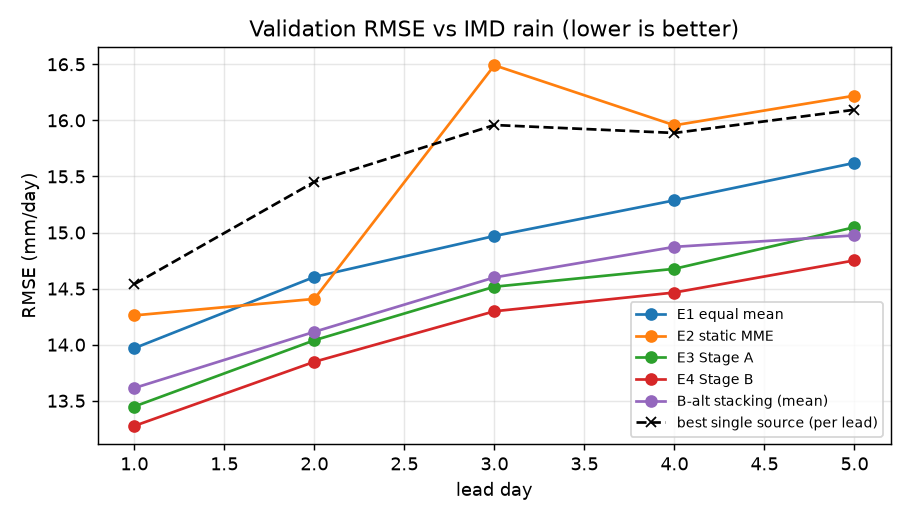
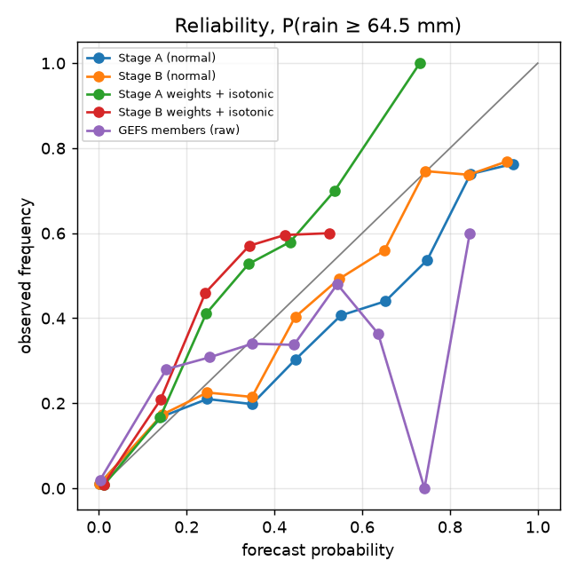
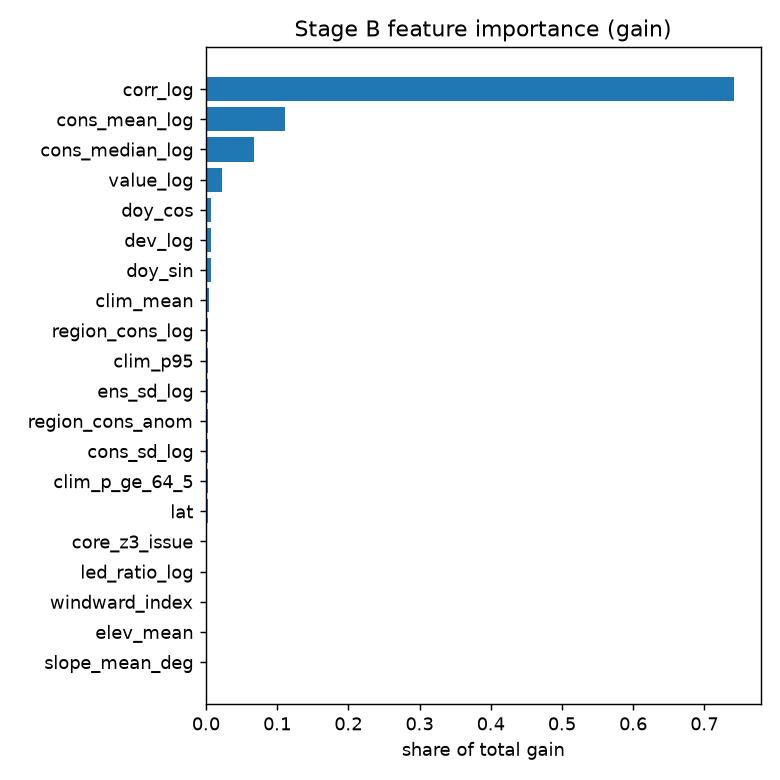
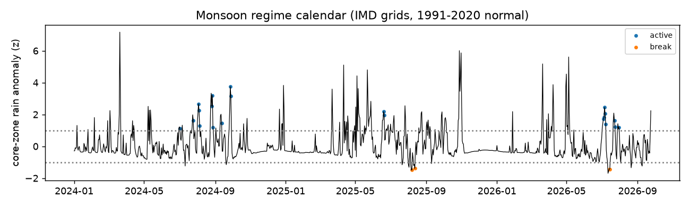

# Validation report (training period, blocked cross-validation)

Generated 2026-09-26T06:42 UTC · commit `486d70a126` · 2024-01-21 to 2024-12-29 · 29 districts · truth: IMD 0.25° gridded rainfall (final)

Every number below is out-of-fold: each month is predicted by models fitted without it and without the 10 days either side. Stage B's tau/lambda and the sigma scale are cross-fitted. The frozen test season (June-September 2025) is not used.

Chosen Stage B variant (lowest validation RMSE): **E4 Stage B**.

## Rain, all methods, by lead

### Lead day 1

| method | n | rmse | mae | bias | corr | ets_64_5 | pod_64_5 | far_64_5 | ets_115_6 | sedi_115_6 |
|:---|---:|---:|---:|---:|---:|---:|---:|---:|---:|---:|
| E8 Stage B without season | 9976 | 13.25 | 5.36 | -0.70 | 0.75 | 0.30 | 0.38 | 0.38 | 0.07 | 0.49 |
| E5 Stage B without regime | 9976 | 13.26 | 5.37 | -0.76 | 0.75 | 0.29 | 0.37 | 0.38 | 0.07 | 0.49 |
| E6 Stage B without lead | 9976 | 13.27 | 5.38 | -0.74 | 0.75 | 0.29 | 0.37 | 0.38 | 0.07 | 0.49 |
| E7 Stage B without place | 9976 | 13.27 | 5.38 | -0.74 | 0.75 | 0.29 | 0.37 | 0.38 | 0.07 | 0.49 |
| E4 Stage B | 9976 | 13.28 | 5.38 | -0.73 | 0.75 | 0.29 | 0.37 | 0.38 | 0.07 | 0.49 |
| E4w Stage B (row weights) | 9976 | 13.30 | 5.36 | -0.84 | 0.75 | 0.28 | 0.35 | 0.37 | 0.04 | 0.43 |
| E10 Stage B without ensemble sources | 9976 | 13.33 | 5.38 | -0.82 | 0.75 | 0.28 | 0.36 | 0.39 | 0.06 | 0.47 |
| E3 Stage A | 9976 | 13.45 | 5.61 | -0.01 | 0.74 | 0.31 | 0.41 | 0.41 | 0.10 | 0.53 |
| E9 Stage B without ai sources | 9976 | 13.52 | 5.46 | -0.81 | 0.74 | 0.28 | 0.35 | 0.40 | 0.03 | 0.36 |
| B-alt stacking (mean) | 9976 | 13.61 | 6.14 | -0.05 | 0.73 | 0.12 | 0.14 | 0.51 | 0.00 | – |
| E1 equal mean | 9976 | 13.97 | 5.66 | -1.07 | 0.73 | 0.09 | 0.09 | 0.38 | 0.02 | – |
| E2 static MME | 9976 | 14.26 | 5.94 | 0.19 | 0.72 | 0.32 | 0.46 | 0.45 | 0.08 | 0.46 |
| gefs_ens | 9976 | 14.54 | 5.92 | -1.01 | 0.69 | 0.10 | 0.12 | 0.51 | 0.02 | – |
| ecmwf_aifs025_single | 7888 | 14.87 | 7.43 | 0.97 | 0.74 | 0.29 | 0.40 | 0.43 | 0.04 | 0.41 |
| ecmwf_ifs025 | 9541 | 15.31 | 6.45 | -0.70 | 0.66 | 0.15 | 0.18 | 0.48 | 0.03 | 0.34 |
| cma_grapes_global | 9976 | 16.95 | 6.88 | -1.36 | 0.57 | 0.11 | 0.17 | 0.70 | 0.02 | 0.30 |
| jma_gsm | 7337 | 17.02 | 7.11 | -1.73 | 0.63 | 0.13 | 0.16 | 0.52 | -0.00 | – |
| gem_global | 9976 | 17.36 | 7.38 | 0.17 | 0.55 | 0.10 | 0.15 | 0.74 | 0.05 | 0.40 |
| meteofrance_arpege_world | 7337 | 17.53 | 7.09 | -3.29 | 0.62 | 0.12 | 0.14 | 0.45 | 0.02 | 0.30 |
| gfs_global | 7337 | 17.67 | 7.12 | -2.26 | 0.61 | 0.19 | 0.25 | 0.51 | 0.03 | 0.30 |
| icon_global | 7337 | 17.68 | 6.94 | -4.44 | 0.64 | 0.06 | 0.06 | 0.35 | 0.02 | 0.30 |
| ukmo_global_deterministic_10km | 957 | 18.18 | 9.80 | -8.09 | 0.29 | 0.04 | 0.05 | 0.80 | -0.00 | – |
| bom_access_global | 9976 | 21.62 | 8.26 | 0.52 | 0.41 | 0.06 | 0.11 | 0.83 | 0.02 | 0.27 |

### Lead day 2

| method | n | rmse | mae | bias | corr | ets_64_5 | pod_64_5 | far_64_5 | ets_115_6 | sedi_115_6 |
|:---|---:|---:|---:|---:|---:|---:|---:|---:|---:|---:|
| E8 Stage B without season | 9947 | 13.83 | 5.63 | -0.77 | 0.72 | 0.28 | 0.35 | 0.41 | 0.03 | 0.42 |
| E5 Stage B without regime | 9947 | 13.84 | 5.63 | -0.83 | 0.72 | 0.27 | 0.35 | 0.41 | 0.03 | 0.42 |
| E7 Stage B without place | 9947 | 13.85 | 5.64 | -0.82 | 0.72 | 0.27 | 0.34 | 0.40 | 0.03 | 0.42 |
| E4 Stage B | 9947 | 13.85 | 5.64 | -0.80 | 0.72 | 0.26 | 0.34 | 0.42 | 0.03 | 0.42 |
| E6 Stage B without lead | 9947 | 13.85 | 5.64 | -0.81 | 0.72 | 0.26 | 0.33 | 0.42 | 0.03 | 0.42 |
| E10 Stage B without ensemble sources | 9947 | 13.86 | 5.62 | -0.90 | 0.72 | 0.26 | 0.33 | 0.40 | 0.04 | 0.47 |
| E4w Stage B (row weights) | 9947 | 13.87 | 5.64 | -0.92 | 0.72 | 0.26 | 0.33 | 0.39 | 0.03 | 0.42 |
| E3 Stage A | 9947 | 14.04 | 5.84 | -0.05 | 0.71 | 0.28 | 0.38 | 0.46 | 0.08 | 0.49 |
| E9 Stage B without ai sources | 9947 | 14.11 | 5.73 | -0.89 | 0.71 | 0.27 | 0.34 | 0.41 | 0.01 | 0.34 |
| B-alt stacking (mean) | 9947 | 14.11 | 6.39 | 0.02 | 0.71 | 0.11 | 0.14 | 0.53 | 0.00 | – |
| E2 static MME | 9947 | 14.41 | 6.10 | 0.51 | 0.71 | 0.31 | 0.42 | 0.44 | 0.11 | 0.54 |
| E1 equal mean | 9947 | 14.60 | 5.96 | -1.04 | 0.70 | 0.04 | 0.05 | 0.59 | 0.00 | – |
| gefs_ens | 9947 | 15.45 | 6.19 | -1.56 | 0.64 | 0.03 | 0.04 | 0.71 | -0.00 | – |
| ecmwf_aifs025_single | 7859 | 15.56 | 7.92 | 1.45 | 0.71 | 0.27 | 0.36 | 0.43 | 0.04 | 0.40 |
| ukmo_global_deterministic_10km | 928 | 15.57 | 6.79 | -6.47 | 0.45 | 0.00 | 0.00 | – | 0.00 | – |
| ecmwf_ifs025 | 9512 | 16.22 | 6.76 | -0.76 | 0.61 | 0.13 | 0.17 | 0.60 | 0.01 | 0.28 |
| jma_gsm | 7308 | 17.25 | 7.41 | -1.63 | 0.62 | 0.12 | 0.15 | 0.55 | 0.00 | – |
| cma_grapes_global | 9947 | 17.46 | 7.12 | -1.56 | 0.54 | 0.13 | 0.18 | 0.60 | 0.01 | 0.21 |
| meteofrance_arpege_world | 7308 | 18.00 | 7.34 | -3.17 | 0.59 | 0.09 | 0.10 | 0.56 | -0.00 | – |
| gem_global | 9947 | 18.00 | 7.92 | 0.78 | 0.52 | 0.10 | 0.15 | 0.74 | 0.04 | 0.37 |
| icon_global | 7308 | 18.09 | 7.16 | -4.76 | 0.64 | 0.04 | 0.04 | 0.33 | 0.00 | – |
| gfs_global | 7308 | 19.31 | 7.60 | -2.75 | 0.53 | 0.11 | 0.16 | 0.62 | 0.01 | 0.23 |
| bom_access_global | 9947 | 26.88 | 8.91 | 0.82 | 0.30 | 0.04 | 0.09 | 0.87 | 0.01 | 0.11 |

### Lead day 3

| method | n | rmse | mae | bias | corr | ets_64_5 | pod_64_5 | far_64_5 | ets_115_6 | sedi_115_6 |
|:---|---:|---:|---:|---:|---:|---:|---:|---:|---:|---:|
| E10 Stage B without ensemble sources | 9918 | 14.25 | 5.86 | -0.90 | 0.70 | 0.24 | 0.31 | 0.43 | -0.00 | – |
| E8 Stage B without season | 9918 | 14.28 | 5.88 | -0.76 | 0.70 | 0.25 | 0.32 | 0.44 | -0.00 | – |
| E5 Stage B without regime | 9918 | 14.29 | 5.88 | -0.82 | 0.70 | 0.24 | 0.31 | 0.44 | -0.00 | – |
| E4 Stage B | 9918 | 14.30 | 5.89 | -0.79 | 0.70 | 0.24 | 0.31 | 0.44 | -0.00 | – |
| E6 Stage B without lead | 9918 | 14.30 | 5.89 | -0.80 | 0.70 | 0.24 | 0.31 | 0.44 | -0.00 | – |
| E7 Stage B without place | 9918 | 14.31 | 5.89 | -0.81 | 0.70 | 0.23 | 0.30 | 0.44 | -0.00 | – |
| E4w Stage B (row weights) | 9918 | 14.33 | 5.89 | -0.91 | 0.70 | 0.24 | 0.30 | 0.42 | -0.00 | – |
| E3 Stage A | 9918 | 14.52 | 6.22 | 0.23 | 0.69 | 0.27 | 0.36 | 0.45 | 0.01 | 0.28 |
| E9 Stage B without ai sources | 9918 | 14.56 | 5.99 | -0.88 | 0.69 | 0.22 | 0.28 | 0.46 | 0.00 | – |
| B-alt stacking (mean) | 9918 | 14.60 | 6.71 | 0.12 | 0.68 | 0.09 | 0.12 | 0.60 | 0.00 | – |
| E1 equal mean | 9918 | 14.97 | 6.15 | -1.08 | 0.68 | 0.03 | 0.03 | 0.64 | 0.00 | – |
| E2 static MME | 9918 | 16.49 | 6.63 | 0.70 | 0.64 | 0.30 | 0.45 | 0.48 | 0.15 | 0.60 |
| gefs_ens | 9918 | 15.96 | 6.41 | -1.45 | 0.61 | 0.01 | 0.02 | 0.88 | 0.00 | – |
| ecmwf_aifs025_single | 7830 | 16.13 | 8.26 | 1.60 | 0.69 | 0.25 | 0.34 | 0.45 | 0.04 | 0.43 |
| jma_gsm | 7279 | 17.64 | 7.54 | -1.89 | 0.60 | 0.06 | 0.08 | 0.72 | -0.00 | – |
| gem_global | 9918 | 18.06 | 7.94 | 0.51 | 0.50 | 0.09 | 0.14 | 0.73 | 0.01 | 0.26 |
| ecmwf_ifs025 | 9483 | 18.13 | 7.57 | 0.23 | 0.54 | 0.10 | 0.15 | 0.73 | 0.02 | 0.30 |
| meteofrance_arpege_world | 7279 | 18.22 | 7.43 | -3.58 | 0.58 | 0.07 | 0.08 | 0.55 | -0.00 | – |
| ukmo_global_deterministic_10km | 290 | 18.99 | 10.64 | -10.36 | 0.41 | 0.00 | 0.00 | – | 0.00 | – |
| icon_global | 7279 | 19.00 | 7.54 | -5.04 | 0.57 | 0.01 | 0.02 | 0.71 | 0.02 | 0.37 |
| cma_grapes_global | 9918 | 19.10 | 7.54 | -1.42 | 0.49 | 0.12 | 0.19 | 0.69 | 0.04 | 0.36 |
| gfs_global | 7279 | 19.43 | 7.86 | -2.95 | 0.52 | 0.12 | 0.16 | 0.62 | 0.01 | 0.19 |
| bom_access_global | 9860 | 25.21 | 8.36 | -0.47 | 0.29 | 0.04 | 0.06 | 0.87 | 0.01 | 0.14 |

### Lead day 4

| method | n | rmse | mae | bias | corr | ets_64_5 | pod_64_5 | far_64_5 | ets_115_6 | sedi_115_6 |
|:---|---:|---:|---:|---:|---:|---:|---:|---:|---:|---:|
| E8 Stage B without season | 9889 | 14.45 | 5.97 | -0.87 | 0.69 | 0.24 | 0.30 | 0.41 | 0.02 | – |
| E4 Stage B | 9889 | 14.46 | 5.98 | -0.90 | 0.69 | 0.24 | 0.30 | 0.41 | 0.02 | – |
| E5 Stage B without regime | 9889 | 14.47 | 5.98 | -0.94 | 0.69 | 0.23 | 0.29 | 0.42 | 0.02 | – |
| E7 Stage B without place | 9889 | 14.47 | 5.98 | -0.92 | 0.69 | 0.24 | 0.29 | 0.41 | 0.02 | – |
| E6 Stage B without lead | 9889 | 14.47 | 5.98 | -0.92 | 0.69 | 0.23 | 0.29 | 0.42 | 0.02 | – |
| E10 Stage B without ensemble sources | 9889 | 14.50 | 5.97 | -1.04 | 0.69 | 0.24 | 0.29 | 0.38 | 0.03 | – |
| E4w Stage B (row weights) | 9889 | 14.51 | 5.99 | -0.99 | 0.69 | 0.23 | 0.28 | 0.41 | 0.02 | – |
| E3 Stage A | 9889 | 14.68 | 6.39 | 0.16 | 0.68 | 0.25 | 0.33 | 0.45 | 0.03 | 0.39 |
| E9 Stage B without ai sources | 9889 | 14.74 | 6.10 | -1.00 | 0.68 | 0.23 | 0.28 | 0.40 | -0.00 | – |
| B-alt stacking (mean) | 9889 | 14.87 | 6.84 | 0.11 | 0.67 | 0.09 | 0.11 | 0.62 | 0.00 | – |
| E1 equal mean | 9889 | 15.29 | 6.32 | -1.08 | 0.66 | 0.03 | 0.04 | 0.63 | 0.00 | – |
| E2 static MME | 9889 | 15.96 | 6.88 | 0.78 | 0.65 | 0.27 | 0.42 | 0.54 | 0.05 | 0.41 |
| gefs_ens | 9889 | 15.89 | 6.45 | -1.60 | 0.62 | 0.01 | 0.01 | 0.81 | 0.00 | – |
| ecmwf_aifs025_single | 7801 | 16.41 | 8.36 | 1.51 | 0.68 | 0.23 | 0.31 | 0.47 | 0.03 | 0.37 |
| ecmwf_ifs025 | 9454 | 17.27 | 7.39 | -0.67 | 0.56 | 0.09 | 0.14 | 0.73 | 0.03 | 0.35 |
| jma_gsm | 7250 | 17.87 | 7.68 | -2.14 | 0.59 | 0.09 | 0.11 | 0.59 | -0.00 | – |
| gem_global | 9889 | 18.36 | 8.12 | 0.57 | 0.49 | 0.09 | 0.14 | 0.74 | 0.02 | 0.31 |
| ukmo_global_deterministic_10km | 609 | 19.45 | 9.25 | -9.06 | 0.41 | 0.00 | 0.00 | – | 0.00 | – |
| icon_global | 7250 | 19.70 | 7.91 | -5.50 | 0.53 | 0.01 | 0.01 | 0.81 | -0.00 | – |
| gfs_global | 7250 | 19.83 | 7.85 | -3.32 | 0.50 | 0.11 | 0.13 | 0.56 | -0.00 | – |
| cma_grapes_global | 9889 | 22.17 | 8.28 | -0.66 | 0.40 | 0.10 | 0.16 | 0.76 | 0.03 | 0.31 |
| bom_access_global | 9802 | 25.21 | 8.64 | -0.55 | 0.27 | 0.01 | 0.03 | 0.93 | -0.00 | – |

### Lead day 5

| method | n | rmse | mae | bias | corr | ets_64_5 | pod_64_5 | far_64_5 | ets_115_6 | sedi_115_6 |
|:---|---:|---:|---:|---:|---:|---:|---:|---:|---:|---:|
| E8 Stage B without season | 9860 | 14.72 | 6.06 | -1.31 | 0.68 | 0.19 | 0.23 | 0.37 | 0.00 | – |
| E6 Stage B without lead | 9860 | 14.75 | 6.07 | -1.35 | 0.68 | 0.19 | 0.23 | 0.37 | 0.00 | – |
| E4 Stage B | 9860 | 14.75 | 6.08 | -1.33 | 0.68 | 0.20 | 0.23 | 0.36 | 0.00 | – |
| E5 Stage B without regime | 9860 | 14.76 | 6.07 | -1.37 | 0.68 | 0.20 | 0.23 | 0.35 | 0.00 | – |
| E7 Stage B without place | 9860 | 14.76 | 6.08 | -1.35 | 0.68 | 0.20 | 0.23 | 0.36 | 0.00 | – |
| E10 Stage B without ensemble sources | 9860 | 14.80 | 6.07 | -1.52 | 0.68 | 0.18 | 0.20 | 0.36 | 0.00 | – |
| E4w Stage B (row weights) | 9860 | 14.81 | 6.09 | -1.41 | 0.68 | 0.20 | 0.23 | 0.35 | 0.00 | – |
| B-alt stacking (mean) | 9860 | 14.97 | 6.94 | 0.10 | 0.67 | 0.09 | 0.11 | 0.60 | 0.00 | – |
| E3 Stage A | 9860 | 15.05 | 6.55 | -0.19 | 0.66 | 0.22 | 0.28 | 0.44 | 0.05 | – |
| E9 Stage B without ai sources | 9860 | 15.05 | 6.19 | -1.49 | 0.67 | 0.18 | 0.21 | 0.38 | 0.00 | – |
| E1 equal mean | 9860 | 15.62 | 6.46 | -1.43 | 0.65 | 0.02 | 0.02 | 0.78 | 0.00 | – |
| E2 static MME | 9860 | 16.22 | 6.92 | 0.35 | 0.63 | 0.24 | 0.36 | 0.53 | 0.05 | 0.41 |
| gefs_ens | 9860 | 16.09 | 6.53 | -1.71 | 0.61 | 0.02 | 0.02 | 0.74 | 0.00 | – |
| ecmwf_aifs025_single | 7772 | 16.37 | 8.32 | 1.18 | 0.68 | 0.24 | 0.31 | 0.45 | 0.04 | 0.43 |
| ecmwf_ifs025 | 9425 | 17.94 | 7.59 | -0.76 | 0.52 | 0.08 | 0.13 | 0.76 | 0.01 | 0.26 |
| jma_gsm | 7221 | 18.04 | 7.85 | -2.29 | 0.58 | 0.05 | 0.06 | 0.70 | 0.00 | – |
| gem_global | 9860 | 18.77 | 8.50 | 1.18 | 0.49 | 0.09 | 0.15 | 0.74 | 0.02 | 0.31 |
| icon_global | 7221 | 20.22 | 8.11 | -5.78 | 0.49 | 0.01 | 0.01 | 0.79 | 0.02 | 0.30 |
| gfs_global | 7221 | 20.75 | 8.25 | -6.77 | 0.48 | 0.01 | 0.01 | 0.82 | -0.00 | – |
| ukmo_global_deterministic_10km | 1247 | 22.48 | 10.95 | -10.74 | 0.37 | 0.00 | 0.00 | – | 0.00 | – |
| bom_access_global | 9686 | 22.51 | 8.47 | -1.10 | 0.29 | 0.02 | 0.04 | 0.91 | -0.00 | – |
| cma_grapes_global | 9801 | 28.73 | 8.82 | 0.10 | 0.33 | 0.14 | 0.23 | 0.69 | 0.04 | 0.37 |

## Stage B vs references: paired 5-day block bootstrap (RMSE difference, mm)

Negative = Stage B better. An interval that crosses zero is not a demonstrated gain.

| lead | b | diff | lo | hi |
|:---|---:|---:|---:|---:|
| 1 | E3 Stage A | -0.17 | -0.46 | 0.08 |
| 1 | E2 static MME | -0.99 | -1.89 | -0.18 |
| 1 | E1 equal mean | -0.69 | -1.35 | -0.11 |
| 1 | B-alt stacking (mean) | -0.34 | -1.00 | 0.19 |
| 1 | best source (gefs_ens) | -1.26 | -2.14 | -0.45 |
| 2 | E3 Stage A | -0.19 | -0.53 | 0.06 |
| 2 | E2 static MME | -0.56 | -1.45 | 0.20 |
| 2 | E1 equal mean | -0.76 | -1.35 | -0.20 |
| 2 | B-alt stacking (mean) | -0.27 | -0.84 | 0.22 |
| 2 | best source (gefs_ens) | -1.60 | -2.44 | -0.82 |
| 3 | E3 Stage A | -0.22 | -0.43 | -0.02 |
| 3 | E2 static MME | -2.19 | -4.55 | -0.19 |
| 3 | E1 equal mean | -0.67 | -1.26 | -0.08 |
| 3 | B-alt stacking (mean) | -0.30 | -0.77 | 0.09 |
| 3 | best source (gefs_ens) | -1.66 | -2.51 | -0.85 |
| 4 | E3 Stage A | -0.21 | -0.48 | 0.03 |
| 4 | E2 static MME | -1.49 | -2.33 | -0.65 |
| 4 | E1 equal mean | -0.82 | -1.42 | -0.30 |
| 4 | B-alt stacking (mean) | -0.41 | -0.87 | 0.04 |
| 4 | best source (gefs_ens) | -1.42 | -2.29 | -0.60 |
| 5 | E3 Stage A | -0.30 | -0.63 | 0.04 |
| 5 | E2 static MME | -1.47 | -2.93 | -0.21 |
| 5 | E1 equal mean | -0.87 | -1.40 | -0.40 |
| 5 | B-alt stacking (mean) | -0.22 | -0.62 | 0.20 |
| 5 | best source (gefs_ens) | -1.34 | -2.07 | -0.67 |

## Probabilistic scores

| lead | method | crps_normal | quantile_score | coverage_10_90 |
|:---|---:|---:|---:|---:|
| 1 | Stage A | 4.39 | 1.94 | 0.85 |
| 1 | Stage B | 4.03 | 1.81 | 0.88 |
| 1 | B-alt quantiles | – | 2.02 | 0.88 |
| 2 | Stage A | 4.59 | 2.01 | 0.84 |
| 2 | Stage B | 4.24 | 1.91 | 0.89 |
| 2 | B-alt quantiles | – | 2.08 | 0.87 |
| 3 | Stage A | 4.84 | 2.12 | 0.84 |
| 3 | Stage B | 4.43 | 1.98 | 0.88 |
| 3 | B-alt quantiles | – | 2.15 | 0.86 |
| 4 | Stage A | 4.98 | 2.19 | 0.84 |
| 4 | Stage B | 4.55 | 2.03 | 0.88 |
| 4 | B-alt quantiles | – | 2.18 | 0.86 |
| 5 | Stage A | 5.12 | 2.26 | 0.84 |
| 5 | Stage B | 4.65 | 2.08 | 0.88 |
| 5 | B-alt quantiles | – | 2.21 | 0.86 |

Coverage of the 10-90% range should be close to 0.80.

## Exceedance probabilities: Brier skill vs IMD 1991-2020 climatology

| threshold | method | n | events | brier | bss_vs_climatology | reliability | resolution |
|:---|---:|---:|---:|---:|---:|---:|---:|
| 64.500 | Stage A (normal) | 49590 | 1325 | 0.020 | 0.100 | 0.001 | 0.006 |
| 64.500 | Stage B (normal) | 49590 | 1325 | 0.019 | 0.137 | 0.000 | 0.007 |
| 64.500 | Stage A weights + isotonic | 49590 | 1325 | 0.020 | 0.097 | 0.001 | 0.006 |
| 64.500 | Stage B weights + isotonic | 49590 | 1325 | 0.020 | 0.091 | 0.001 | 0.006 |
| 64.500 | GEFS members (raw) | 49590 | 1325 | 0.024 | -0.063 | 0.001 | 0.002 |
| 64.500 | IMD climatology 1991-2020 | 49590 | 1325 | 0.022 | 0.000 | 0.001 | 0.004 |
| 115.600 | Stage A (normal) | 49590 | 320 | 0.006 | 0.013 | 0.000 | 0.000 |
| 115.600 | Stage B (normal) | 49590 | 320 | 0.006 | 0.041 | 0.000 | 0.001 |
| 115.600 | Stage A weights + isotonic | 49590 | 320 | 0.006 | 0.027 | 0.000 | 0.000 |
| 115.600 | Stage B weights + isotonic | 49590 | 320 | 0.006 | 0.023 | 0.000 | 0.000 |
| 115.600 | GEFS members (raw) | 49590 | 320 | 0.006 | -0.070 | 0.000 | 0.000 |
| 115.600 | IMD climatology 1991-2020 | 49590 | 320 | 0.006 | 0.000 | 0.000 | 0.000 |
| 204.500 | Stage A (normal) | 49590 | 30 | 0.001 | -0.029 | 0.000 | 0.000 |
| 204.500 | Stage B (normal) | 49590 | 30 | 0.001 | -0.021 | 0.000 | 0.000 |
| 204.500 | Stage A weights + isotonic | 49590 | 30 | 0.001 | -0.003 | 0.000 | 0.000 |
| 204.500 | Stage B weights + isotonic | 49590 | 30 | 0.001 | -0.002 | 0.000 | 0.000 |
| 204.500 | IMD climatology 1991-2020 | 49590 | 30 | 0.001 | 0.000 | 0.000 | 0.000 |

## Stratified RMSE (all leads)

| by | group | n | E3 Stage A | E4 Stage B | E2 static MME | E1 equal mean |
|:---|---:|---:|---:|---:|---:|---:|
| region | kerala | 23940 | 13.45 | 13.21 | 14.92 | 13.41 |
| region | konkan | 25650 | 15.15 | 14.95 | 16.01 | 16.16 |
| terrain_class | coast | 29070 | 16.73 | 16.45 | 17.74 | 17.46 |
| terrain_class | crest | 3420 | 10.35 | 10.49 | 11.12 | 10.51 |
| terrain_class | plateau | 3420 | 6.59 | 6.25 | 6.99 | 6.35 |
| terrain_class | windward_slope | 13680 | 10.72 | 10.57 | 12.57 | 10.93 |
| regime | active | 1595 | 19.75 | 18.90 | 23.65 | 21.15 |
| regime | normal | 16095 | 21.27 | 21.16 | 23.06 | 22.52 |
| regime | off_season | 31900 | 8.52 | 8.18 | 8.76 | 8.17 |
| intensity | dry <2.5 | 33017 | 4.76 | 3.90 | 5.32 | 4.44 |
| intensity | light-moderate | 8843 | 12.69 | 10.64 | 14.82 | 9.47 |
| intensity | rather heavy | 6405 | 20.59 | 20.42 | 25.12 | 18.86 |
| intensity | heavy | 1005 | 43.95 | 45.56 | 43.61 | 52.27 |
| intensity | very heavy+ | 320 | 102.93 | 106.78 | 97.99 | 119.14 |

## Stage B feature importance (gain share, top 15)

| feature | gain_share |
|:---|---:|
| corr_log | 0.742 |
| cons_mean_log | 0.111 |
| cons_median_log | 0.068 |
| value_log | 0.022 |
| doy_cos | 0.008 |
| dev_log | 0.007 |
| doy_sin | 0.007 |
| clim_mean | 0.004 |
| region_cons_log | 0.003 |
| clim_p95 | 0.003 |
| ens_sd_log | 0.003 |
| region_cons_anom | 0.003 |
| cons_sd_log | 0.002 |
| clim_p_ge_64_5 | 0.002 |
| lat | 0.002 |

## Figures

